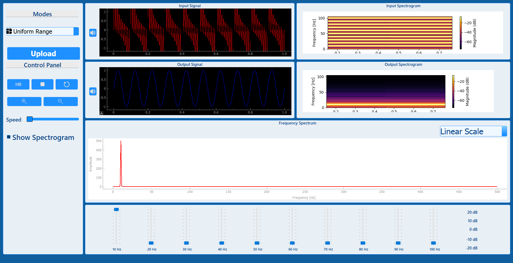
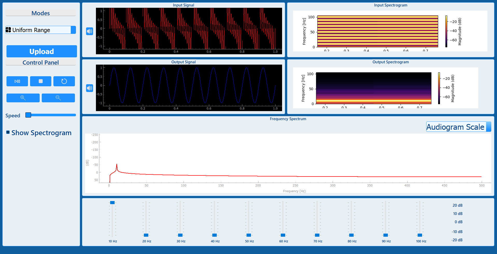

# Signal Equalizer



## Description

- Desktop Application Designed For Modifying The Magnitude Of Specific Frequency Components In Audio & Other Signal Types
- User-Friendly Interface Containing Spectrogram & Frquency Spectrum Of The Browsed Signal
- Provides Multiple Modes For Different Audio Signals

## Tech Stack Used

|**Functionality** | |
|--- | --- |
|**UI** | |
|**Styling** | [](#)|

## Features
### 1. Uniform Range
- Showcase A Combined Signal Of Sinusoidals Whose Frequencies Range From 10 To 100 Hz


### 2. Music & Animals Mode
- Allow Control Of The Magnitude Of Specific Musical Instruments & Animals Sounds In A Mixed Signal

https://github.com/user-attachments/assets/e27580c4-8888-40c0-8022-6c3363c86765

### 3. Music & Vowels Mode
- Allow Control Of The Magnitude Of Specific Musical Instruments & Specific Letters In A Song

### 4. Wiener Filter
- Enable The Reduction Of Noise & Enhancement Of Signal Quality

https://github.com/user-attachments/assets/d5af1f76-e06e-4ad8-b0d0-7e919246919f

## Installation

1. Make Sure That Pip & Python Are Installed On Your System

2. Clone The Repo Onto Your Local System or Download The Zip File & Extract It
   ```bash
    git clone https://github.com/mostafa-aboelmagd/signal-equalizer.git
    ```

3. Nagivate To The Project's Directory 
   
4. Install The Required Libraries
    ```bash
    pip install -r requirements.txt
    ```

5. Run `main.py` File
    ```bash
    python main.py
    ```

## Contributors

| Name | GitHub | LinkedIn |
| ---- | ------ | -------- |
| Mostafa Ayman | [](https://github.com/mostafa-aboelmagd) | [](https://www.linkedin.com/in/mostafa--aboelmagd/) |
| Ali Zayan | [](https://github.com/alizayan684) | [](https://www.linkedin.com/in/%D8%B9%D9%84%D9%8A-%D8%B2%D9%8A%D8%A7%D9%86-%F0%9F%94%BB%F0%9F%87%B5%F0%9F%87%B8-b98239264/) |
| Zeyad Amr | [](https://github.com/Zisco2002)| [](https://www.linkedin.com/in/zeyad-amr-3506b225b/) |
| Mostafa Mousa | [](https://github.com/MostafaMousaaa) | [](https://www.linkedin.com/in/mostafa-mousa-b81b8322a/) |
| Omar Khaled | [](#)| [](https://www.linkedin.com/in/omar-khaled-064b7930a/) |
